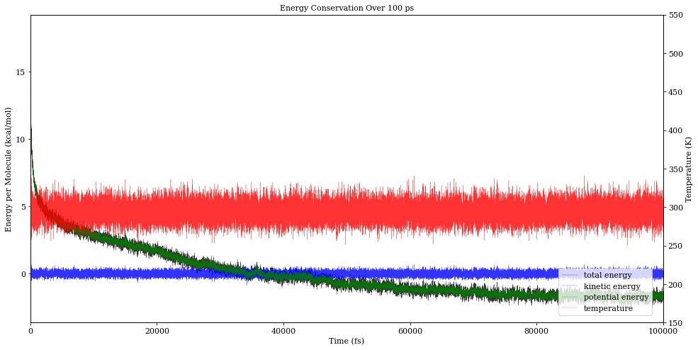
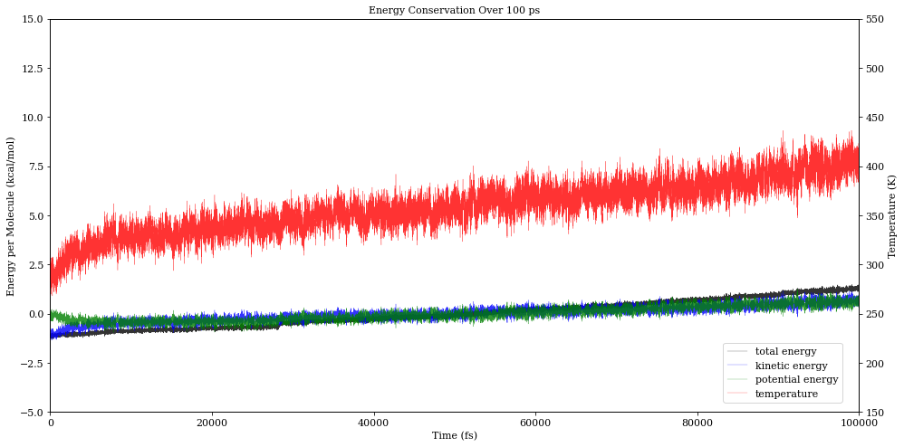

# Physical Validation

A common test for molecular dynamics programs is to validate that energy is conserved in the microcanonical (NVE) ensemble.
Here, we present the result of two runs to demonstrate that *presto* controls temperature in the canonical (NVT) ensemble 
and conserves energy in the microcanonical (NVE) ensemble, as expected.

The first run is a thermostatted (NVT) 100 ps equilibration of 100 DCM molecules using the GFN-FF forcefield. 
The initial configuration was generated by PACKMOL and is clearly unphysical, as indicated by the rapid potential energy relaxation.
However, the Langevin thermostat successfully holds the average temperature at 300 K.
(The rapid fluctuations in temperature are a result of measuring an ensemble average on a small number of molecules and are expected.)

The second 100 ps run was initiated from the last frame of the first run, and is run without a thermostat.
The initial burst in temperature indicates that the previous system was not fully relaxed:
ater the first 10 ps, however, the temperature rises only gradually (on the order of 1 kcal/molecule over 50 ps). 

For this 500-atom simulation, a linear fit to the temperature drift gives a slope of 2.44 kcal/(mol•ps).
This is orders of magnitude worse than dedicated molecular dynamics programs like [OpenMM](https://www.biorxiv.org/node/23099.article-info),
but should not be a problem for the short NVE trajectories in *presto*.
The exact origin of this energy creep is unclear but may arise from numerical precision issues in the forcefield or ``hdf5`` storage format. 
(We are investigating further.)
