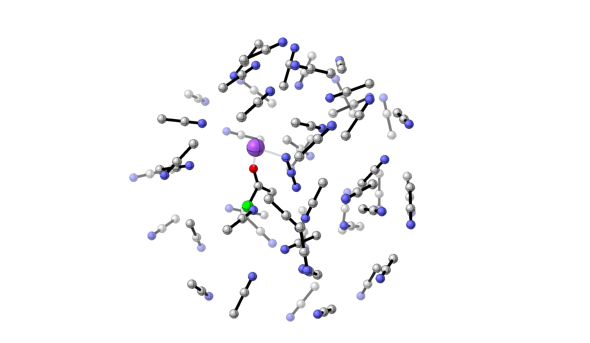
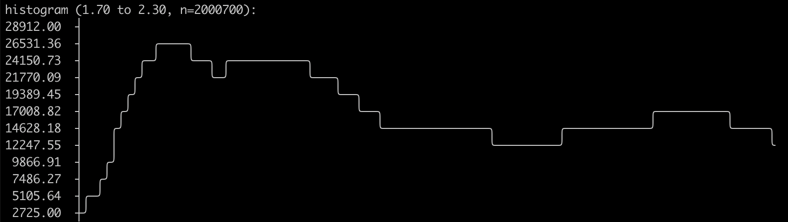
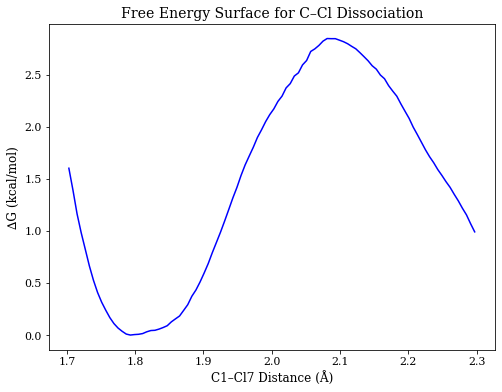

# Tutorial

For this tutorial, we will examine the reaction of acetyl chloride and sodium azide in acetonitrile.
Experimental data, in conjunction with [previous gas-phase results](https://cctk.readthedocs.io/en/latest/tutorial_05.html),
suggest that strong nucleophiles avoid a discrete tetrahedral intermediate when reacting with acyl chlorides,
instead proceeding through a concerted addition-elimination mechanism.
However, the effect of solvation and explicit counterions on this picture remain unknown.

The simplicity of this system (8 heavy atoms) makes it a relatively facile demonstration of *presto*. 
More complex systems can be run analogously, but will require more careful setup and analysis.

*This tutorial is meant to demonstrate an example workflow from start to finish. 
All output files are already present in this directory, along with the requisite scripts for analysis.
The following steps detail how these results were generated and how to analyze them.*

## Overview

Ultimately, we want to view the moment when bonds are forming and breaking: the region around the transition state.
For truly barrierless reactions (e.g. [nitration of toluene](https://pubs.acs.org/doi/10.1021/jacs.6b07328)), 
one can simply combine the reagents in solvent and watch them react.
However, most reactions have a meaningful barrier and  will not react over the timescales we can simulate.
(Although theoretically one could run an exceptionally long simulation and wait for a reaction to happen, this is likely to be an exercise in futility.)
Instead, we generally want to start our trajectories from a high-energy point (like a transition state) and watch how they propagate from there, 
which ensures that we're simulating only "interesting" configurations.

To find the transition state, we need to construct the free energy profile in explicit solvent.
To do this, we run biased simulations where we constrain the system along the reaction coordinate with narrow harmonic constraints, 
and them "undo" the biasing potential mathematically to construct the free energy surface.
(This is somewhat analogous to a scan along a bond distance, but each "point" is comprised of thousands of frames from a trajectory.)
We will use *wham* to construct the PES from our individual trajectories—for more details, see [this presentation](https://pubs.acs.org/doi/10.1021/jacs.6b07328).

Once we know where the transition state is, we can spawn individual unconstrained trajectories from the appropriate constrained trajectory
and propagate them forwards and backwards in time to connect products and starting materials. 
We typically want to spawn several hundred reaction trajectories: luckily, each one should be only a few picoseconds.

The overall workflow then, looks like this:
1. **Build solvated system** using *PACKMOL*
2. **Equilibrate** to arrive at a reasonable starting configuration
3. **Compute Potential Energy Surface** using *wham*
4. **Run Trajectories** starting from transition state
5. **Extract Results and Analyze**
6. **Interpretation and Future Work**

## Step 1: Build Solvated System

The starting material and product were brought together in GaussView to a rough pre-reactive conformation (``AcCl_NaN3.xyz``), and the system was solvated with 50 acetonitrile molecules using ``packmol/build_input.py`` (which automatically creates a sphere at the correct density for STP):

```
$ python ../packmol/build_input.py -f AcCl_NaN3.xyz -o solvated.xyz -s acetonitrile -n 50
```

The radius of the resultant solvated system was 10.2 Å, and the system had 311 atoms in total. 
As the following image shows, this just barely manages to solvate this tiny system: larger solutes will require correspondingly larger solvation shells.
(It would probably be better to use more solvent here too, but I want to keep the tutorial relatively fast.)



## Step 2: Equilibrate System

To equilibrate the system properly, two separate equilibration runs were employed.

The first ("preequilibration") begins at 1000 K with frozen solute (``inactive_atoms``) and slowly cools the system to room temperature over 5.0 ps, 
equilibrating for an additional 5.0 ps at room temperature.
The corresponding config file (``preequil.yaml``) is shown below. Notice that since only the solvent is being simulated, only ``xtb`` is needed.
The timestep for this simulation is 1 fs (``timestep``), so this run will take 10,000 frames to finish (``stop_time`` = 10000 fs = 10 ps). 

```
type: equilibration

timestep: 1
high_atoms: 1-11
inactive_atoms: 1-11
stop_time: 10000

integrator:
    type: langevin
    viscosity: 0.0001

potential:
    type: spherical_harmonic
    radius: 10.5

calculator:
    type: xtb
    gfn : 0
    parallel: 8

bath_scheduler:
    type: linear
    start_temp: 1000
    target_temp: 298
    target_time: 5000
```

Once the solvent preequilibration is done, equilibration of the whole system can begin.
This equilibration uses an ONIOM calculator with two constraints:
one for the C–N distance and one for the C–Cl distance. 
These constraints prevent collapse to starting material or product, freezing the system in a conformation near the transition state.

*Note that systems restrained in this fashion are fundamentally unphysical and tend to try to "escape" the high-energy configuration by any means possible.
Any unconstrained reaction that the system can undergo to lower its energy is likely to occur; 
be sure to visualize your results frequently to make sure nothing bizarre has happened!*

(An additional "anchor" is also put in place on C1 to prevent the solute from leaving the center of the sphere.)

```
type: equilibration

timestep: 1
high_atoms: 1-11
stop_time: 20000

anchor: 1

integrator:
    type: langevin
    viscosity: 0.0001

potential:
    type: spherical_harmonic
    radius: 10.5

calculator:
    type: oniom
    low_calculator:
        type: xtb
        gfn : 0
        parallel: 8
    high_calculator:
        type: gaussian
        route_card: "#p force b3lyp/6-31g(d) empiricaldispersion=gd3bj pop=none"
        link0:
            nprocshared: 16
            mem: "32GB"

bath_scheduler:
    type: constant
    target_temp: 298

constraints:
    constraint1:
        atom1: 1
        atom2: [8,9,10]
        equilibrium: 3.53
        force_constant: 500
        power: 2
    constraint2:
        atom1: 1
        atom2: 7
        equilibrium: 1.80
        force_constant: 500
        power: 2
``` 

On a 2020 Intel Cascade Lake processor, *presto* can run 25 frames in 4–10 minutes (depending on shared disk load). 
Accordingly, this 20 ps equilibration should take 2–5 days to run.

To analyze these jobs as they progress, the ``analyze.py`` and ``analyze_reaction.py`` scripts can be used.
``analyze.py`` gives a detailed look at the temperature/energy profile of a single job, 
while ``analyze_reaction.py`` allows the batch analysis of many jobs in terms of starting/ending conditions.
Using ``analyze_reaction.py --monitor`` permits visualization of key reaction coordinates (defined in ``rxn.yaml``).

```
$ python analyze.py -c 0 preequil.yaml preequil.chk
$ python analyze_reaction.py -m rxn.yaml equil.chk
```

## Step 3: Compute Potential Energy Surface

To find the actual transition state, the potential energy surface in explicit solvent must be calculated.
This can be derived from a series of trajectories where the coordinate of interest is constrained 
(analogous to a "scan" in Gaussian, albeit where every point is a trajectory).
We will use the weighted histogram analysis method (WHAM) to construct the PES from the individual trajectories, 
using the [*wham*](http://membrane.urmc.rochester.edu/?page_id=126) program from the Grossfield lab.
(*wham* is not computationally intensive and can be run on a laptop or login node.)

We have the choice of  analyzing either the forming (C–N) or breaking (C–Cl) bond.
Since the nucleophile has two identical nucleophilic nitrogens, we opted to scan along the C–Cl distance for simplicity.
The script ``wham/wham.py run`` generates new ``.yaml`` files and starting configurations from the equilibrated system, which can be run in parallel. 
Here, we generate 100 new runs with C1–Cl7 distances ranging from 1.7 Å to 2.3 Å, and run them using ``wham/submit_all.sh``. 
(All configuration values for the run other than the ``wham`` biasing constraint can be found in ``wham.yaml``, which is read and copied by ``wham.py``.)

```
$ cd wham
$ python wham.py run 1 7 1.7 2.3 100 "../equil.chk"
$ bash submit_all.sh
```

Progress can be monitored using ``analyze_reaction.py``, or by simply viewing the associated logfiles:

```
$ python analyze_reaction.py rxn.yaml wham/*.chk
$ for f in wham/*.log; do tail -1 $f; done
```

When the jobs are complete (which took about a week for me), the data can be exported to ``.csv`` files for import into *wham* using ``wham/wham.py analyze`` 
The appropriate ``metadata.txt`` file is also written (see the documentation for *wham* for a full explanation of these options and files).
Each run is 25.0 ps long, but the first 5.0 ps will be discarded to allow the systems to relax following application of the biasing potential.
In total, then, this PES is based on 2.0 ns of simulation, or 2 million individual frames!

```
$ cd wham
$ python wham.py analyze -C 5000 1 7 1.7 2.3 100 "*.chk"
```


``wham.py`` prints a small histogram as a "check" that the biasing potential worked as expected. 
Here, we can see roughly even distribution along the reaction coordinate, with the exception of short C–Cl distances (which are very repulsive).



We can then run *wham* and write the PES to ``wham-output``.

```
$ wham 1.7 2.3 100 0.001 298 0 metadata.txt wham-output
```

Plotting the points from ``wham-output`` (using ``wham/plot_pes.ipynb``) generates the following free energy surface, with a clear transition state at 2.08 Å!




## Step 4: Run Trajectories

We are now ready to start trajectories from the region of the transition state, which corresponds to ``wham/equil_0064``.
For the sake of this exercise, we will spawn a new trajectory every 250 fs, 
meaning that we can generate 80 trajectories from the 20.0 ps production run carried out in the previous section.
Each trajectory will be propagated forwards and backwards in time until starting material or product is reached.
Unlike equilibration, each trajectory will be run in the NVE ensemble (without a thermostat).

The reaction config file ``rxn.yaml`` is shown below. 
Most of the parameters are the same, but this file also contains ``termination_conditions``

```
# presto config file

type: equilibration

timestep: 1
high_atoms: 1-11
stop_time: 5000

integrator:
    type: verlet

potential:
    type: spherical_harmonic
    radius: 10.5

calculator:
    type: oniom
    low_calculator:
        type: xtb
        gfn : 0
        parallel: 8
    high_calculator:
        type: gaussian
        route_card: "#p force b3lyp/6-31g(d) empiricaldispersion=gd3bj pop=none"
        link0:
            nprocshared: 16
            mem: "32GB"

bath_scheduler:
    type: constant
    target_temp: 298

termination_function:
    constraint1f: bond 1 9
    constraint2f: bond 1 10
    constraint3r: bond 1 7
    
monitor:
    var1: distance 1 9
    var2: distance 1 10
    var3: distance 1 7
    var4: distance 10 11
    var5: distance 11 2
    var6: distance 11 7
```

We will use ``spawn.py`` to generate the  ``.chk`` files for the trajectories.

```
$ python spawn.py -i 250 wham/equil_0064.chk 5000 80 rxn.yaml trajs/traj
$ cd trajs
$ bash submit_all.sh
```

## Step 5: Extract Results and Analyze

## Step 6: Interpretation and Future Work

To properly examine this system (e.g. for publication), 
- ergodicity = multiple starting configurations
