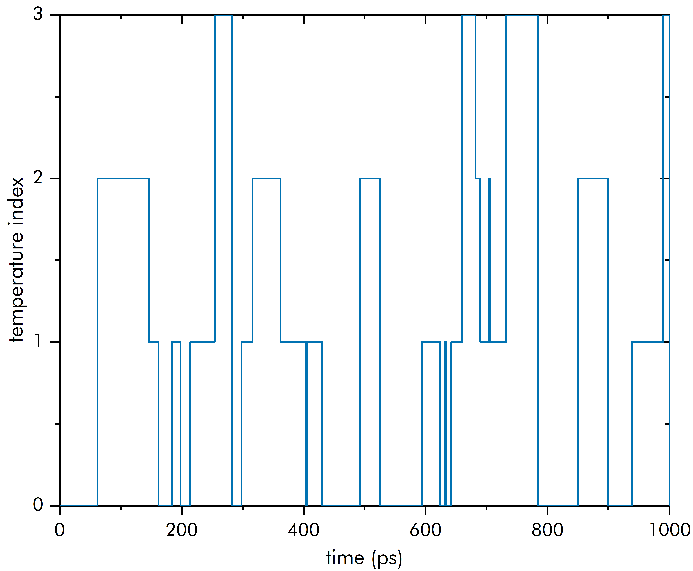
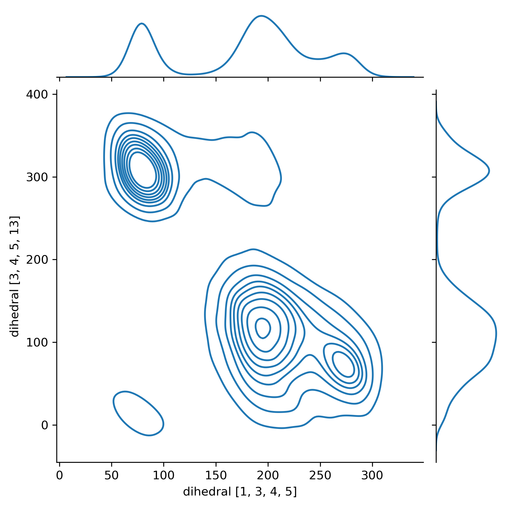
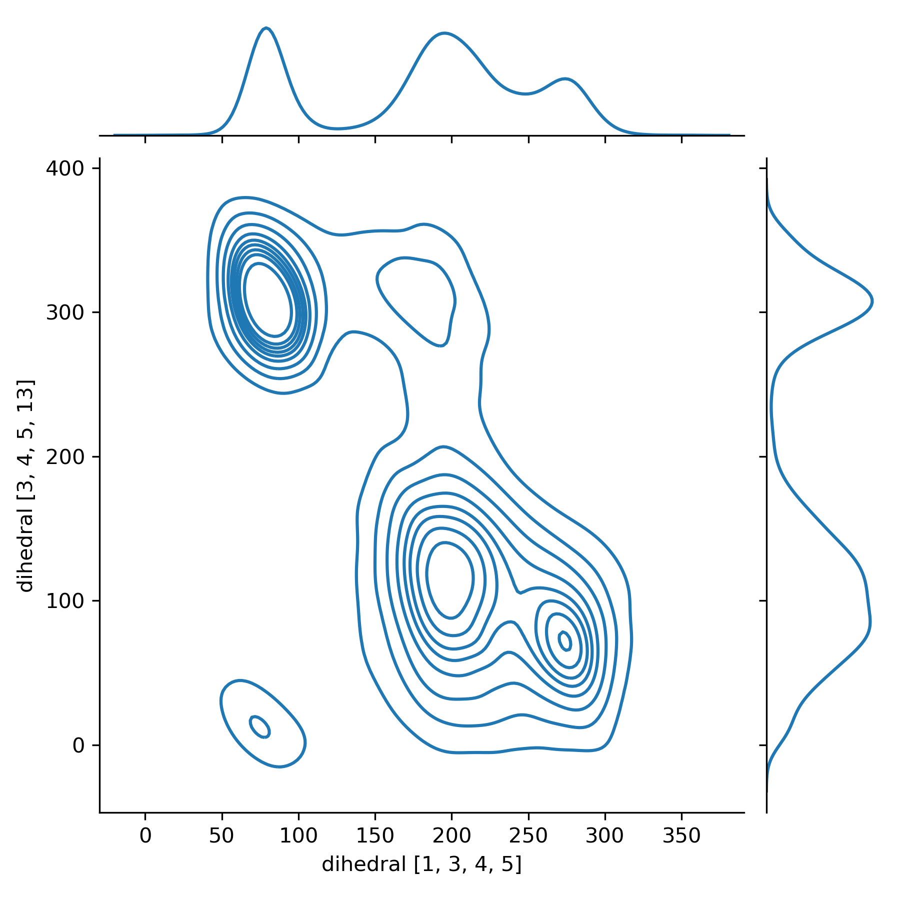

# Tutorial xx: Replica Exchange Molecular Dynamics

Building on your familiarity with running equilibration trajectories, this tutorial will introduce you to running replica exchange molecular dynamics (REMD) in *presto*.

## Introduction

As a bare-bones example, we will use replica exchange molecular dynamics to explore part of the potential energy surface of alanine dipeptide (_N_-acetyl-<span style="font-size:0.9em">L</span>-alanine-_N_'-methylamide) in the gas phase. We will perform calculations at the [GFN-FF](https://xtb-docs.readthedocs.io/en/latest/gfnff.html) [level](https://onlinelibrary.wiley.com/doi/full/10.1002/anie.202004239) so that the REMD run can be completed in a short time (1–2 days), keeping in mind that we realistically use *presto* for explicitly solvated molecules at the *ab initio* level.

Here, we will perform a REMD simulation with alanine dipeptide using four replicas from 300 K to 1000 K. *presto* will distribute the temperatures of the replicas according to a geometric progression based on the specified minimum and maximum temperatures. Each MD frame will last 1 fs and we will perform the exchange every 2 ps (i.e. 2000 frames). We will target a total runtime of 1 ns.

## Input and Output Files

REMD in *presto* requires the [Slurm](https://Slurm.schedmd.com/documentation.html) scheduling system, and assumes that jobs are submitted using `$ sbatch <jobscript>`.

We first activate the presto virtual environment if applicable, then copy the two scripts needed to run REMD from the `scripts/` folder. As its name implies, the first script manages the REMD run and is the only script the user needs to call. For each script, all the available command line options can be viewed by running `$ python <script>.py --help`.

```sh
$ conda activate presto  

$ cp <presto home>/scripts/{remd_par_manager,traj_array}.py .
```

We then prepare two Slurm submit scripts. The first, named `remd_ala2.sh`, is used to run the manager script.

```sh
#!/bin/bash
#SBATCH --job-name=remd_par_manager_ala2
#SBATCH --output=slurm-remd_par_manager.out
#SBATCH --open-mode=append
#SBATCH --ntasks=1
#SBATCH --cpus-per-task=1
#SBATCH -t 00:10:00
#SBATCH --mem-per-cpu=8000mb
#SBATCH --mail-type=FAIL
## partition is Yale cluster-specific
#SBATCH --partition=day

# Yale cluster-specific
# module purge 2>/dev/null
# module load miniconda 2>/dev/null

conda activate presto 2>/dev/null
python remd_par_manager.py --input ala2.xyz --swap 2000 --mintemp 300 --maxtemp 1000 --trajs 4 -t template.yaml
```

The second Slurm script, `traj_array.sh`, is for `traj_array.py`. This is not called directly by the user. The following sample script includes instructions to change the number of trajectories and allocated resources.

``` sh
#!/bin/bash
### this file is not intended to be sbatch'ed on its own
#SBATCH --job-name=remd_traj_array_fs
#SBATCH --output=slurm-traj_arrays.out
#SBATCH --open-mode=append
#SBATCH --ntasks=1
## do not modify above this line
## set array indices from 0 to (number of trajectories - 1)
#SBATCH --array=0-3
# settings below are allocated per-trajectory
#SBATCH --cpus-per-task=4
#SBATCH --mem-per-cpu=8000mb
#SBATCH -t 01:00:00
## partition is Yale cluster-specific
#SBATCH --partition=day

python traj_array.py -i $SLURM_ARRAY_TASK_ID --checkpoint_filename remd.chk
```

We need to supply the geometry input file (you can find `ala2.xyz` for this example in this folder) and a template config (.yaml) file (`template.yaml` in this folder). In the template config file, we fill the `target_temp` field with `<TEMP>`. The intended REMD runtime is supplied here in the `stop_time` field, as is the case for a usual single-trajectory run. The template config file is shown here:

```yaml
type: equilibration

timestep: 1
high_atoms: 1-22
stop_time: 1000000
save_interval: 10

anchor: 1

integrator: 
    type: langevin
    viscosity: 0.0001

potential:
    type: spherical_harmonic
    radius: 10

calculator:
    type: xtb
    gfn : ff
    parallel: 2

bath_scheduler: 
    type: constant
    target_temp: <TEMP>
```

## Running

Initiating the run is as simple as running

```sh
$ sbatch remd_ala2.sh
```

This will start a job named `remd_par_manager_ala2`, which will initiate a Slurm job array named `remd_traj_array_<current time>fs`, which is responsible for actually propagating the trajectories. The manager job will spawn another instance of itself (`remd_par_manager_ala2`), which starts running once the job array is completed.

The output files include:

1. `<temp>k.chk`: checkpoint file for a trajectory at \<temp\> K. We can examine each trajectory with `scripts/analyze.py` just like in Tutorial 00.
2. `remd.log`: log file for all running modules. We use this file to monitor trajectory progress and check for warnings.
3. `remd.chk`: checkpoint file for the `ReplicaExchange` run. Required for final analysis of the REMD run.

When the REMD run is complete, the end of `remd.log` should contain a completion message and a report similar to the following:

```console
07-19 04:03 __main__      Replica exchange completed.
07-19 04:03 __main__      

----------------REPORT----------------

07-19 04:03 __main__      Time: 1000000 fs
Exchange probability: 20.00%
    Replica 0 <=> Replica 1  	20.00%
    Replica 1 <=> Replica 2  	20.00%
    Replica 2 <=> Replica 3  	20.00%
```

## Analyzing the REMD run

### Reconstructing the temperature evolution of each replica

In REMD, efficient diffusion of configurations between temperatures is necessary for a well-converged run. _presto_ keeps tracks of the swaps performed after each _swap\_interval_ in the REMD checkpoint file. We can use a script (`scripts/remd_demux.py`) to reconstruct the continuous trajectories of each replica as it (randomly) walked through temperature space (aka demultiplex or "demux").

We first copy the demuxing script into the current directory and then demux:

``` sh
$ cp <presto home>/scripts/remd_demux.py .

$ python remd_demux.py --checkpoint_filename remd.chk
```

_Note: This script takes a while on longer trajectories (> 500 ps)—consider running this as a batch job or in the background._

This will output 1) checkpoint files for the demuxed trajectories (e.g. `replica0.chk`), PDB files of the demuxed trajectories (e.g. `replica0.pdb`), and CSV files containing the temperature evolutions of each trajectory (e.g. `replica0.csv`).

The CSV files will tell us whether efficient diffusion between temperatures occurred. The first column contains the time in multiples of the swap interval, and the second column contains the _index_ of the temperature. These data can be visualized in your favorite program. For example, for Replica 0:



As we can see, this replica started at 300 K and moving efficiently across temperatures; this can also be verified for the other replicas.

Now, say we are interested in the potential energy surface of alanine dipeptide with respect to its Ramachandran _φ_ and _ψ_ angles; this can also be thought of as cluster analysis over these two coordinates.

For this purpose, we use another provided script:

```sh
$ cp <presto home>/scripts/traj_cluster.py .
```

This script can plot the 1-D or 2-D kernel density-estimated distributions of up to two internal coordinates (distance, length, dihedral) from a trajectory checkpoint file. The `seaborn` and `pandas` packages (`$ conda install seaborn pandas`) are required for this script.

We perform the cluster analysis on the _φ_ and _ψ_ angles (again, preferably not on the login node 😉), and rename the output files appropriately:

``` sh
$ python traj_cluster.py -c 300k.chk --dihedral 1 3 4 5 --dihedral 3 4 5 13

$ mv cluster2d.png 300k_1ns_cluster.png

$ python traj_cluster.py -c traj0.chk --dihedral 1 3 4 5 --dihedral 3 4 5 13

$ mv cluster2d.png 300k_demux_1ns_cluster.png
```

Here are the plots for the trajectories at 300 K (left) and the demuxed trajectory for Replica 0 (right). _φ_ is plotted on the x-axis and _ψ_ on the y-axis.




The first key observation is that Replica 0 is sampling all the minima exhibited by the 300 K trajectory; in other words, within this replica, the system was able to cross energy barriers separating the minima. We can verify that the other trajectories also exhibit this characteristic, indicating that replica exchange is indeed allowing us to efficiently explore the alanine dipeptide PES.

We would also expect that the 300 K trajectory be "sharper" due to the lower temperature thoughout the trajectory; indeed, the system is localized to fewer minima than Replica 0.

By visually inspecting the KDE plot, Replica 0 accessed six minima, reported below from lower to higher energy with the corresponding names as reported in [the literature](https://onlinelibrary.wiley.com/doi/full/10.1002/jcc.25589).

| conformer name | _φ_ (approx. deg) | _ψ_ (approx. deg) |
|-----------|------------------|------------------|
| C7<sub>ax<sub>      | 75               | –60 (300)          |
| C5        | –160 (200)         | 120              |
| C7<sub>eq<sub>      | –85 (275)          | 80               |
| α'    | –160 (200)         | –50 (310)          |
| α<sub>L<sub>   | 60               | 30               |
| α<sub>R<sub>   | –90 (270)          | –5 (355)           |

The energy ordering above only roughly agrees with the relative energies reported in the literature; this is acceptable in view of the low level of theory used in this example. Fortunately, with _presto_, it is straightforward to perform an analogous study at a higher level with explicit solvation.
